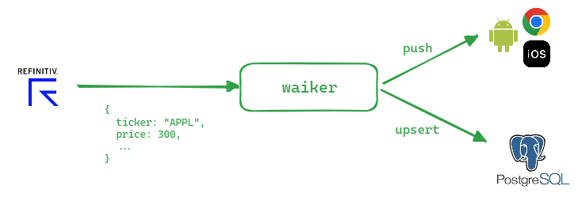
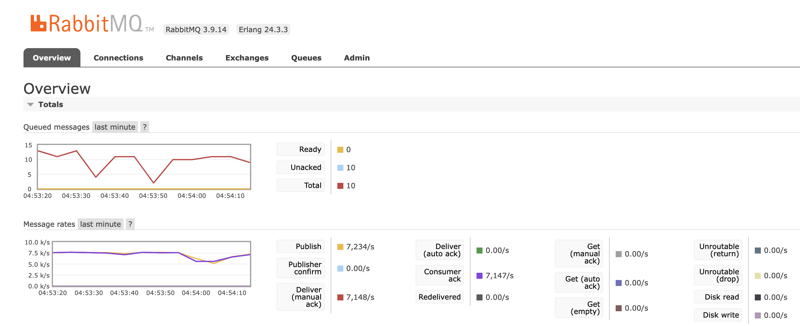

## 시스템 설계 경험

시스템을 직접 설계해서 MSA로 분해하고 각 서비스간 통신을 위해 메시지큐를 도입해나간 과정과 레피니티브의 시세 트래픽을 밀리지 않고 I/O 작업을 처리하기 위해 적용했던 설계방식, 문제해결 과정을 정리했습니다. 

 

### 하위 페이지
- [메시지 큐 기반 시스템 분해작업](/architecture-experience/message-queue-usage)
- [스레드 최적화](/architecture-experience/consumer-thread-optimization)
- [테스트케이스 경험](/architecture-experience/test-case-experience)
- [프로젝트를 다시 한다면](if-project-again)

 

#### 프로젝트 설명

한국증권거래소 처럼 증권 시세를 Serving 하는 레피니티브라고 하는 회사의 시세 데이터를 1차 가공한 후 웹소켓 Push, Database 저장하는 것을 담당하는 시스템입니다. 

 

#### 트래픽 규모

트래픽은 아래와 같이 2.5k/s \~ 7.5k/s 였습니다. 

> 개장(Market Open) 트래픽 추이 

 

> 폐장(Markt Close) 트래픽 추이

 

#### 주요 문제

2.5k/s \~ 7.5k/s 의 트래픽을 밀리지 않고 데이터를 저장하고, 웹소켓을 통해 웹/앱 으로 Push 를 해야 했습니다. 

웹소켓 푸시, 데이터 저장에 드는 I/O 작업의 시간 비용은 고정적으로 소모되므로, 일반적인 서버 애플리케이션의 처리방식과는 다른 접근방식이 필요했습니다. 또한, 요청이 유실 되었을 경우 이것을 복구해낼 방법이 필요했는데 이 부분에 대한 접근방식도 필요했습니다. 

 