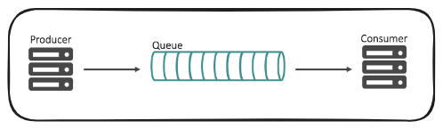

## 프로젝트를 다시 한다면

## Exactly Once 보장

메시지를 통신 상으로 오직 한번만 받을 수 있음이 보장되는 Exactly Once 를 적용하지 못한 것은 아쉬운 점이라고 생각합니다. 

개발 당시에는 주식 시세 데이터 특성상 초/분/시/일 데이터에 대해서 고가/저가/현재가/종가만 계속해서 업데이트하면 되고  데이터의 중복보다는 업데이트가 더 중요했기에 Exactly Once 가 중요하지는 않았습니다. 

다시 프로젝트를 하게 될 경우, 통신 매커니즘 레벨에서는 1번만 메시지를 받을 수 있음을 보장하게끔 Exactly Once가 보장되도록 아래와 같은 시도를 할 것 같습니다.  

알수 없는 장애 또는 비즈니스 요건상 장애 발생시 

- 카프카 내의 `장애` 토픽에 장애 데이터, 키값, 장애 발생처 등에 대한 정보를 적재
  - `장애` 토픽이 정상 운영중이라면, 장애 처리 인스턴스에서 이것을 비즈니스로직에 따라 처리
- 카프카의 `장애` 토픽이 응답할 수 없는 상태일 때 레디스에 기록
  - 레디스에 기록, AOF 기능 활용
- 레디스가 응답할 수 없는 상태일 때 노드 내의 오프힙 캐시 저장소에 기록
  - 기록된 데이터는 주기적으로 동작하는 별도의 애플리케이션에서 알람,장애 기록 적재 등의 역할을 수행

 

## 상태없는 연산이 필요한 인스턴스에는 k8s 애플리케이션으로 전환

- waiker-data-live
- waiker-data-websocket

waiker-data-live, waiker-data-websocket 은 데이터를 Serving 하는 역할을 수행합니다. 각각의 데이터가 상태가 없이 개별 데이터 건을 전달하기만 하면 되는 역할을 갖고 있기 때문에 EKS 구축과 동시에 k8s 네이티브 애플리케이션으로 전환했을 것 같습니다.  

> waiker-data-websocket 의 경우 여러 개의 docker instance 또는 pod 으로 띄우고 디스커버리 서버가 웹소켓 인스턴스들을 로드밸런싱 하게끔 해줘야 합니다. 이렇게 디스커버리 서버를 통해서 특정 웹소켓 인스턴스로 부하가 몰리지 않도록 디스커버리 서버를 활용할 경우 웹소켓의 경우에도 분산환경을 적용 가능합니다. 
>
> 프로젝트 당시에는 SPOF(Single Point Of Failure) 이슈도 있고 비용절감을 위해서 단일 노드 대신 컨테이너 기반의 다중화 구조로 전환하려고 했지만, 설득에 실패했었습니다. 현재 웨이커 채용공고를 보면, 아마도 아직까지도 SPOF(Single Point Of Failure) 이슈에 취약한 구조로 방치해둔 것으로 보입니다. 

 

## 비동기 논블로킹 지원 네트워크 프로그램으로 전환

- Netty 기반의 웹 애플리케이션으로 전환
- Kotlin, Webflux 기반으로 전환

스레드 하나에 작업 하나를 부여해서 그 작업을 비동기 논블로킹으로 연산했던 것들은 지금에 와서 돌아보면 "IO작업 하나에 정말 너무 비싼 비용을 치룬 것이 아닌가" 하는 생각을 너무나 자주 합니다. 톰캣의 스레드 풀 보다는 Netty 기반의 NIO 네트워킹, 이벤트 루프, 멀티플렉싱 기반 이벤트 채널링이 지원되는 WAS 서버에서 프로젝트가 진행되었다면 조금은 프로젝트가 빨라졌지 않을까 하는 생각도 해봤던 것 같습니다. 

 

## 필드매핑 정합성 검증 서비스 개발

- 당일 트래픽들을 카프카 토픽 컨슈머로 수집
- 로그 적재 시스템 구축
- 로그 데이터를 읽어들여서 시계열 데이터베이스에 배치 기반으로 데이터 적재
- 장 마감 후 일괄 배치 작업을 통한 데이터 보정 작업 및 에러율 검출
- (in-house) 크롤링을 통한 타사 플랫폼 집계 수집 & 데이터와 비교했을 때 데이터 에러 구간 검출

 

개발 기한과 개발 인력이 부족했기에 로그를 추출해서 이것을 기반으로 서비스가 과거에 잘 돌아갔었는지 시세 데이터의 정합성이 어느 정도인지 추측할 수 있는 in-house 툴을 개발할 필요가 있었습니다. 당시에는 1인 개발 체제여서 테스트 코드로만 남겨두었지만, 별도의 프로젝트를 개발할 인력이 있었다면 이렇게 로그 처리 시스템을 구축했을 듯 합니다. 

 

## Kafka, Spring Cloud Function

- 카프카 기반의 메시지 큐로 전환
- RabbitMQ, Kafka 등 메시징 솔루션에 종속되지 않도록 Cloud Function 을 이용한 동시성 처리 기능 개발

 

개발 당시에 카프카 기반의 개발을 하겠다는 입장을 취했지만, 랩장님의 반대가 있었고 카프카를 운영환경에서 고도화 시킬만한 인프라팀의 데브옵스 엔지니어도 부족했습니다. 이런 이유로 클러스터링 기반의 레빗엠큐를 선택했습니다. 레빗엠큐가 성능적으로 전혀 부족한 면이 있는 것은 아니었지만, 카프카의 회복탄력성, 파티셔닝을 통한 확장성, 주키퍼와 브로커들간의 통신을 통해 통신의 신뢰성을 확보하는 등 여러가지 장점을 가지고 있기에 Kafka 기반의 메시징 시스템으로 전환했을 듯 합니다. 

## 생산자/소비자 기반 동시성 처리 구조 커스터마이징

`데이터` 가 아닌 `요청` 을 기록하는 용도의 테이블을 따로 만들어서 기록을 하는 구조로 전환하게 될 것 같습니다.  

동시성 처리가 되어 있는 생산자/소비자 기능은 개별 요청을 기록(Insert) 하고, 주기적으로 이 테이블에서 벌크단위로 기록된 요청 데이터를 읽어들여서 시세테이블에 데이터를 적재하도록 구조를 전환해서 동일행 수정으로 인한 DBMS에서의 잦은 MVCC 이슈를 피하고, 각각의 요청을 고유하게 기록할 수 있는 구조로 전환하게끔 해보고 싶습니다. 

1차적인 데이터 처리 용도의 데이터베이스는 관계형 데이터베이스 대신 시계열 데이터 기반의 데이터베이스를 적용했을 듯 합니다. 

관계형 데이터베이스를 억지로 시계열 데이터에 처음부터 맞추는 것은 억지스럽다는 생각은 했으나 당시 개발 여건 상 팀내의 입지나 여러모로 도입하기가 쉽지 않았습니다. 관계형 데이터베이스는 데이터를 중복을 없애고 일관성있는 논리적인 데이터의 구조를 통해 데이터를 효율적으로 저장하는 것이 목적이기에, 현재가/고가/저가/종가가 계속 변할 때마다 동시성 이슈가 크다고 생각했습니다. 

아마도 프로젝트를 다시 한다면 관계형 데이터베이스에는 최종적으로 데이터를 1분마다 집계한 최종 데이터를 저장하고, TSDB에 시세데이터를 증분기록하게끔 할 것 같습니다. 지금은 이렇게 적긴 했지만, 시세 데이터 자체가 관계형 데이테베이스에 저장한다는 것 자체가 저 자신은 가끔 이해가 안되긴 하지만, 팀내에서 이렇게 하기를 원한다면 관계형 DB에 저장을 하게 될 듯 합니다. 

TSDB(InfluxDB 등) 외에도 MongoDB, ElasticSearch 가 대안이 될수 있을 것 같고, 완전하게 독자적으로 책임질수 있는 여건이라면 관계형 Database 에 시세를 기록하지는 않을 듯 합니다. 대신 시세 조회시에는 API를 통해서 조회를 하게끔 하고, 시세 서비스 내에서는 NoSQL 데이터베이스를 사용하게끔 했을 듯 합니다. 

**중간버퍼 테이블 설계** 

중간버퍼 역할을 할 요청기록 테이블은 온전히 기록을 위한 테이블이기에  `request_outbox_yyyymmddHH24` 의 형식으로 만들것 같고, index 자료구조 유지, MVCC 등에 대해 DBMS 내에서 안정적으로 동작하도록 시간 별 테이블로 분리해둘 것 같습니다. 그리고 요청을 기록하는 데에는 JdbcTemplate 을 적극적으로 활용하게 될 것 같습니다. 

데이터가 많아지면 One 테이블로는 관리가 힘들어집니다. 인덱싱작업 등등 여러가지 작업에 Database의 성능도 느려집니다. 요청을 기록하기 위한 용도라면, `request_outbox_yyyymmddHH24` 과 같은 테이블에 기록해두고, 읽기를 위한 테이블 또는 외부 데이터 시스템에는 스케쥴러로 일정시간마다 특정 사이즈만큼을 꺼내서 어느 정도의 배치 작업을 수행하도록 해서 읽기 작업 데이터베이스와 기록을 위한 테이블을 물리적으로 분리해둘 것 같습니다. 

 

 

**동시성 코드** 

Database 에 요청을 기록하더라도 생산자 측에서는 Redis 등에 캐싱을 해두고 소비자측 스레드에서 이것을 outbox 테이블에 기록을 해야 안전합니다. 요청 기록 수행 실패시 전략은 아래와 같습니다.

- 1\) IO 작업 에러를 다루는 카프카 토픽에 실패 데이터, 실패상태 코드, 익셉션 데이터를 적재
- 2\) 만약 1\) 에서 카프카가 장애로 인해 정상 수행을 하지 못한다면 Redis 에 실패 데이터와 실패코드 등이 포함된 데이터를 적재 
- 3\) Redis 마저 정상 접근이 불가능한 상태라면 Node 내의 오프힙 기반 인메모리 그리드 저장소에 저장
- 4\) 인메모리 그리드 저장소 역시 접근이 불가능한 상태라면, File I/O 를 이용해 노드 내의 특정 파일 시스템에 실패 기록 

 

## EOF

이 당시에 여러 모로 팀 내에 강압적인 면도 많았고, 비인격적인 대우도 많았고, 알게 모르게 뒤에서 비웃는 분들도 많았던 회사였기에 프로젝트 진행을 위한 의사소통 자체가 너무 안되고 업무 외적으로 사적인 요소까지 이해할 수 없는 일들이 너무 많이 실제로 발생해서 힘들게 만들던 시절이었던 것 같습니다. 아마도 다시 프로젝트를 한다면 위의 요소들을 진지하게 고민을 하게 될 듯 합니다. 

