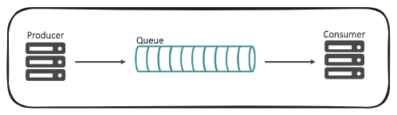

## 메시지 큐 기반 시스템 분해작업


## 레거시 데이터 처리 서버 - valuesight

웨이커에서는 레거시 버전의 데이터 처리서버를 신규 버전으로 새로 개편을 해야 했습니다. valuesight 는 쉽게 설명하면 아래와 같은 역할을 합니다.


- 레피니티브로부터 실시간으로 전달되는 주식 거래 raw 데이터를 수신
- raw 데이터에 대한 현재가, 52주신고가, BID, ASK, 고가, 저가 등의 필드 매핑
- 웹소켓으로 현재가 Push
- 매핑된 데이터를 기반으로 일/시/분/초 별 저가/고가/시가/종가 데이터 집계
- 집계된 데이터를 PostgreSQL 에 저장

<br/>


이 당시 valuesight 서버는 매일 새벽마다 서버가 다운되어서 개발자가 수동으로 재기동시키고, 비어있는 데이터를 크롤링을 통해서 매우고 있었습니다. valuesight WAS 코드에는 동기화/락 코드가 있었기 때문에 레피니티브에서의 시세 데이터 전송 속도를 개별 I/O 처리 작업이 따라가지 못하면서 어느 순간에는 더 이상 처리할 수 없는 상태에 자주 빠지게 되었습니다.<br/>

저의 경우에는 레거시 데이터 처리 서버인 valuesight 의 운영에 대한 어떤 이슈가 있는지에 대한 정보를 거의 전달받지 못하고 신규버전 출시 2주일 전에 코드만 전달 받은 채로 프로젝트를 넘겨받아서 시작했습니다.<br/>

레거시 서버의 신규 서버 전환 작업을 맡으면서 미리 개발자에게 언급 없이 레피니티브의 데이터 구독제를 바꿔서 상용에서 장애가 난 경험도 있었습니다. 이때 1주일간 로그를 추출한 후 필드매핑을 처음부터 일일이 한땀 한땀 떼어서 확인해서 다음날 미국장에 잘 되는지 확인해보던 잠 못자고 살 떨리던 경험도 있었고, M증권사의 개발팀 부장님과 컨택이 되서 구글 밋으로 회의를 하면서 실시간 데이터를 어떻게 처리하는 지에 대한 팁도 얻었던 경험이 있습니다.<br/>

<br/>


## Overview

미국 주식 시세 데이터를 처리하기 위해서 단계적으로 스레드 프로그래밍이 개선을 거듭했고, 최종적으로는 아래와 같은 구조가 되었습니다. 랩장님과 인프라팀의 인원들의 반대로 인해 도입하지 못한 기술적인 면들이 많았지만, 시간내에 프로젝트를 완료시킬 수 있는 최적의 구조는 아래와 같았습니다.


<br/>


## 서비스 역할 정의

"메시지 큐를 단순히 소비자와 생산자를 두는 것이 단순히 처리를 뒤로 미루는 용도로 사용하지 않아야 한다"는 점에 집중해서 작업을 처리하는 구조와 메시지 소비 구조를 맞춰나가는 작업을 해왔습니다.<br/>

<br/>


### waiker-data-live


레피니티브의 미국 주식 시세 데이터는 그 트래픽의 속도가 굉장히 빠릅니다. 이것을 온전히 데이터를 큐잉 하는 작업만으로도 부하가 상당했습니다. 이런 이유로 레피니티브의 raw 데이터를 우리팀의 구조에 맞춰서 변환하는 작업과 RabbitMQ에 지연 없이 전송이 가능하는 역할만을 전담하는 인스턴스인 `waiker-data-live` 를 별도로 두었습니다. 

- 레피니티브 raw 데이터 필드맵 변환
- 데이터타입 정형화
- 변환한 데이터를 RabbitMQ에 큐잉

<br/>

waiker-data-live 는 서비스의 가장 앞단에서 원본 데이터를 서빙하는 역할을 합니다.<br/>

레피니티브의 미국 주식 트래픽이 꽤 높기 때문에 앞단에서 원본 데이터만 서빙하는 역할의 서버를 따로 분리해야 했습니다.<br/>

<br/>


**데이터 타입 정형화**<br/>

이 당시 레피니티브의 공식 문서를 찾거나 레피니티브 개발자 포럼에 질문을 남겨서 특정 필드가 나노세컨드 단위인지 밀리세컨드인지, 정수형 타입, 실수형 타입에는 어떤 것들이 있는지를 모두 확인해서 맞춰둔 후에 데이터타입을 포매팅하는 과정을 거쳤습니다.<br/>

혹시라도 이 글을 읽는 분들 중 레피니티브 데이터 개발 업무를 수행하는 데에 도움이 될 수도 있는 분들이 있을것 같아서 그 코드의 일부를 남겨보면 아래와 같습니다.<br/>


```java
@Slf4j
@Getter
public class FieldEntryUtils {
    // ...
    
	private final Function<FieldEntry, String> fieldEntryToStr_Function = (fieldEntry -> {
        // 자체 정의한 switch ~ case 문에 존재하지 않는 타입도 String 으로 일단 받아서 확인하기 위해 추가
		String str = fieldEntry.load().toString(); 

		switch (fieldEntry.loadType()) {
			case DataTypes.UINT, DataTypes.UINT_1, DataTypes.UINT_2, DataTypes.UINT_4, DataTypes.UINT_8 -> {
				long l = fieldEntry.uintValue();
				str = String.valueOf(l);
			}
			case DataTypes.INT -> {
				long l = fieldEntry.intValue();
				str = String.valueOf(l);
			}
			case DataTypes.REAL, DataTypes.REAL_4RB, DataTypes.REAL_8RB -> {
				double v = fieldEntry.real().asDouble();
				str = String.valueOf(v);
			}
			case DataTypes.DOUBLE, DataTypes.DOUBLE_8, DataTypes.FLOAT, DataTypes.FLOAT_4 -> {
				double v = fieldEntry.doubleValue();
				str = String.valueOf(v);
			}
			case DataTypes.DATE -> {
				if(fieldEntry.date().day() == 0) {
					str = LocalDate.of(fieldEntry.date().year(), fieldEntry.date().month(), 1).format(ServerStockTime.formatter);
				}
				else{
					LocalDate date = LocalDate.of(fieldEntry.date().year(), fieldEntry.date().month(), fieldEntry.date().day());
					str = String.valueOf(date.format(ServerStockTime.formatter));
				}
			}
			case DataTypes.TIME -> {
				LocalTime time = LocalTime.of(fieldEntry.time().hour(), fieldEntry.time().minute(), fieldEntry.time().second(), fieldEntry.time().nanosecond());

				long l = time.toNanoOfDay();
				str = String.valueOf(l);
			}
			case DataTypes.DATETIME -> {
				str = fieldEntry.dateTime().toString();
			}
		}

		return str;
	});
}
```

<br/>


**데이터 구조**<br/>

일반적인 상용 서비스나 현실세계의 데이터가 아니어서 이해는 어렵겠지만, 당시에 사용했던 데이터의 구조는 아래와 같았습니다.

```java
public class FieldEntryDto implements Serializable {
    private String ric;
	private String nbRic;
	private Map<String, String> fieldMap;
	private SymbolDto symbolDto;
    // ...
}
```

그 당시 사용하던 Java 16 에서는 record 키워드가 preview 였고, 이 기능에 record 를 기반으로 전환할 지 고민을 거듭하다가 일반 class 기반으로 두었는데, 아마도 프로젝트를 다시 한다면 record 기반으로 구현하지 않았을까 싶습니다.<br/>

그 당시 메시지 큐를 카프카를 사용하는 것이 아니었기에 파티셔닝에 대해 고민하지 않았다는 점은 확실히 장점이었던 것 같습니다.

<br/>


**아쉬웠던 점**<br/>

waiker-data-live 의 경우 상태가 있는 서버 애플리케이션이 아니기에 EKS로 전환이 쉽고, 저 역시도 EKS 전환이 시급하다고 느껴왔던 프로젝트였지만, 이 당시 개발 기한문제도 있었고 EKS를 운영할 데브옵스 팀의 인력문제로 인해 k8s 네이티브 앱으로 전환하지 못한점이 가장 큰 아쉬움으로 남는 서비스입니다.<br/>

<br/>


### waiker-data-collector


waiker-data-collector 는 `data-live-queue` 에서 데이터를 수신한 후 이 데이터를 일/시/분/초 단위로 시가/고가/종가/저가 를 집계하는 역할을 수행합니다. 그리고 집계된 데이터를 일정 주기별로 RabbitMQ 에 send 하거나 PostgreSQL 에 upsert 를 수행합니다.<br/>

- RabbitMQ `data-live-queue` 의 데이터 수신
- 데이터 필드 매핑 및 변환
- 데이터의 일/시/분/초 별 시가/고가/종가/저가 집계
- 현재가 기반 데이터를 별도의 웹소켓 데이터로 변환 작업 및 캐싱
- 집계된 데이터를 RabbitMQ `websocket-queue` Push
- 집계된 데이터를 PostgreSQL upsert

<br/>

RabbitMQ `data-live-queue` 의 데이터를 수신하는 작업은 데이터의 트래픽이 높기에 별도의 스레딩 처리가 필요했습니다. 이것을 위해 리스너에서 데이터를 수신하는 역할을 하는 `listenerExecutor` 라는 별도의 ExecutorService 를 별도로 선언해두었고 RabbitMQ 로부터의 데이터의 수신작업은 모두 람다 바디 안에서 이뤄지게끔 했습니다.<br/>

데이터의 필드 매핑 및 변환 작업은 기술적으로 난이도가 높지는 않았지만, 주식 데이터의 필드 매핑을 파악하는 작업이 쉽지 않았습니다. 실제 raw 데이터의 필드 중 어떤 것이 실제 거래 가격인지 파악하는 것 부터 어떤 필드를 시간필드로 사용해야 하는지 등을 일일이 로그 파일을 json 덤프파일을 통해 정형화 후 테스트 코드 위에서 개발하는 작업을 거쳤습니다.<br/>

데이터의 일/시/분/초 별 시가/고가/종가/저가 집계 작업은 난이도가 쉬운편에 속했습니다. 특정 시간 영역 내에서 고가보다 높은 값이 들어오면 고가를 갱신하고 저가보다 낮은 가격이 들어오면 저가를 갱신하고, 특정 시간 영역 내의 종가를 계속 업데이트하는 등의 연산이었기에 구현의 난이도는 쉽지 않았습니다.<br/>

집계된 데이터를 RabbitMQ `websocket-queue` Push 작업을 하는 것은 쉽지 않았습니다. RabbitMQ로 데이터를 전송하는 네트워크 로직 자체가 네트워크 통신 로직이기에 블로킹 로직이고 이 블로킹 로직들을 적절한 사이즈의 스레드 풀 내에서 비동기 처리되게끔 해야 했습니다. 웹소켓 데이터의 경우 사용자에게 보여지는 항목이고 DB에 데이터 저장하는 것 보다는 어느 정도는 데이터를 유실되고 최신 데이터를 보내는 것에 중점을 둬야 한다는 것에 초점을 두었고, 오래된 데이터는 ttl 정책에 의해 캐시에서 제거되도록 하고, 일정시간 (0.01ms) 마다 데이터가 있는지를 검사해서 데이터가 있을 경우에만 List 단위로 데이터를 전송하도록 했습니다.

현재가 기반 데이터를 별도의 웹소켓 데이터로 변환 작업 및 캐싱을 하는 작업은 난이도가 높지 않았습니다. 다만, 웹/앱에서 원하는 데이터의 형식을 조율하거나, nbRic, oric 의 요구사항 변경에 따른 로직 변경, 해당 주식 거래소의 현지시각으로 데이터의 거래시각 변경 후 전송 등 기획상에서 자주 바뀌는 부분들에 대해 대응하는 부분들이 많았습니다.<br/>

집계된 데이터를 PostgreSQL upsert 하는 작업은 비교적 비동기 작업의 처리가 수월했습니다. 현재가가 1분에도 수십번 이상 바뀌는 증권데이터 특성상 MVCC 작업으로 인해 PostgreSQL 내에서 Dead Tuple 이 기하급수적으로 늘어나는 현상이 있었습니다. 이 당시 MVCC 성능에 부하가 있더라도 장중 트래픽은 어느정도 느슨했기에 별 이슈는 없었지만, 장시작후 15분간, 장마감 전후 15분간은 MVCC 성능 저하로 인해 DB 데이터 저장에 레이턴시가 생겼고 처리 속도가 느려지는 이슈가 있었습니다. 애플리케이션의 스레드나 메모리를 Grafana 로 보더라도 웹 애플리케이션에는 이슈가 없었지만 DB의 MVCC 관련 이슈로 인해 PostgreSQL 에 Vaccum 작업을 필요한 시기에 제때 제때 해줬어야 했던 이슈가 있었습니다.<br/>


### waiker-data-websocket


waiker-data-websocket 은 `websocket-queue` 의 데이터를 받아서 온전히 데이터를 웹/앱 으로 전송하는 역할만을 담당하도록 했습니다.

초기 개발 시에는 waiker-data-collector 와 waiker-data-websocket 사이에 기능의 경계선이 모호했지만, 개발을 진행하면서 점점 waiker-data-websocket 은 데이터의 물리적인 전송에만 초점을 맞추도록 서비스를 구성했습니다.<br/>

이 당시 EKS 운영하고 관리할 데브옵스 인력이 없어서 EKS 기반의 k8s 앱으로 전환하지 못한 점은 아쉬웠다고 생각합니다.<br/>

데이터를 전송하는 역할에만 초점이 맞춰져있지만, 레피니티브의 시세 데이터를 온전히 소모해야 하는 역할과 갈수록 많아지는 사용자들에게의 데이터 전송하는 역할로 인해 전체 서비스 중 waiker-data-websocket 서비스가 가장 부하가 심했다고 생각합니다.<br/>

<br/>


## 아쉬웠던 점

### Outbox 로의 전환

그 당시 인스턴스 각각은 Producer, Consumer, Queue 로 구성했습니다. 여기서 Queue 는 Hazelcast 를 활용했고 [spring-data-hazelcast](https://github.com/hazelcast/spring-data-hazelcast) 를 통해서 각 요청을 Set, Map\<String, List\<T\>\> 을 통해서 Write-Back 캐싱전략을 구현했습니다.




<br/>

실시간 트래픽이 높고, 데이터의 수정이 자주 발생하는 증권데이터의 특성을 고려해서 Outbox 로 사용할 데이터 스토리지를 결정해야 하는데, 데이터의 수정이 빈번할 경우 관계형 DB의 경우 MVCC 로 인한 이슈가 발생합니다. 따라서 작업 데이터의 대기열 용도의 Outbox 로 사용할 데이터베이스를 지금 시점에서 이 부분에 대한 결정을 내린다면, MongoDB 또는 influxDB와 같은 NoSQL 기반의 데이터베이스의 컬렉션을 두었을 것 같습니다.<br/>

<br/>

