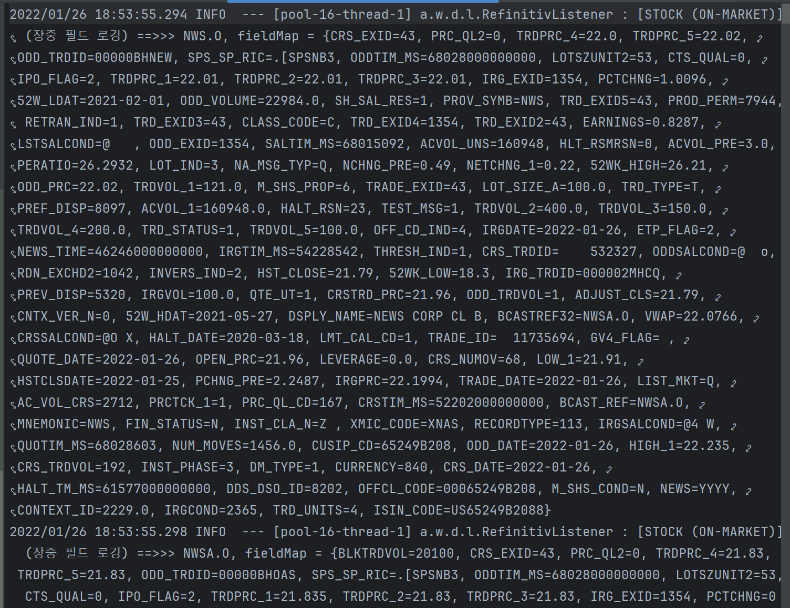
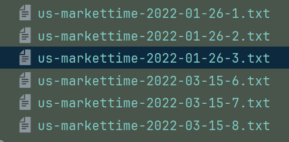
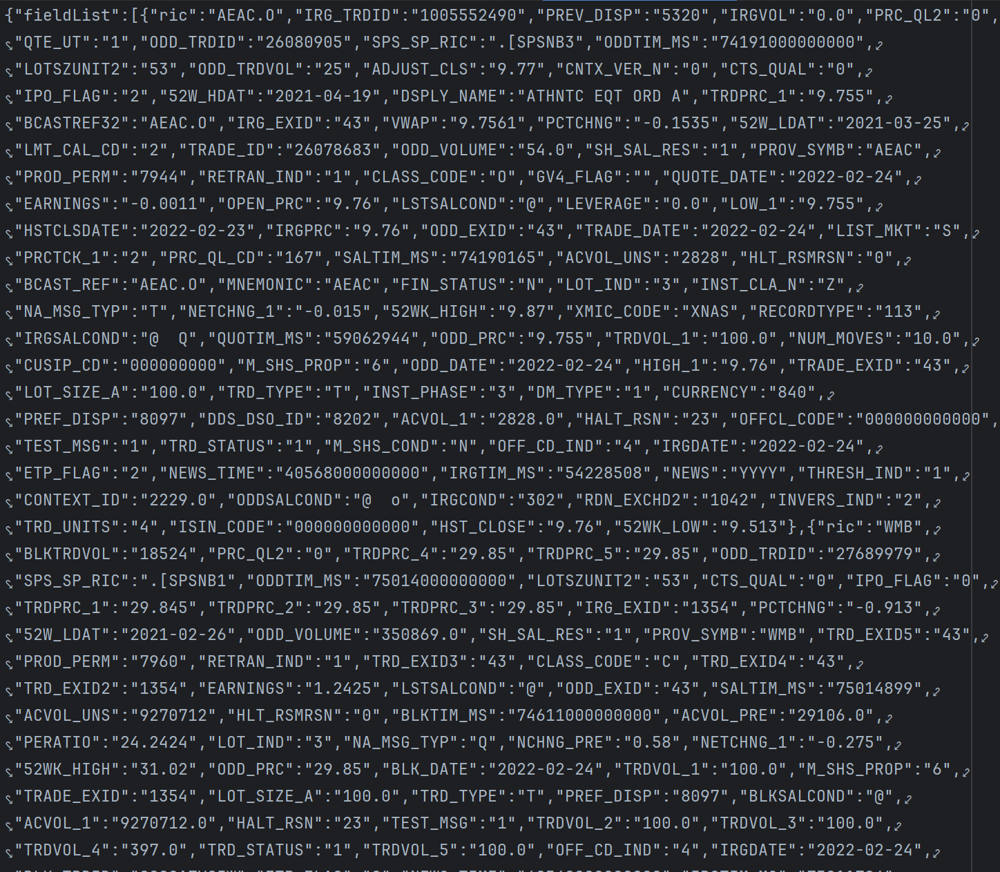
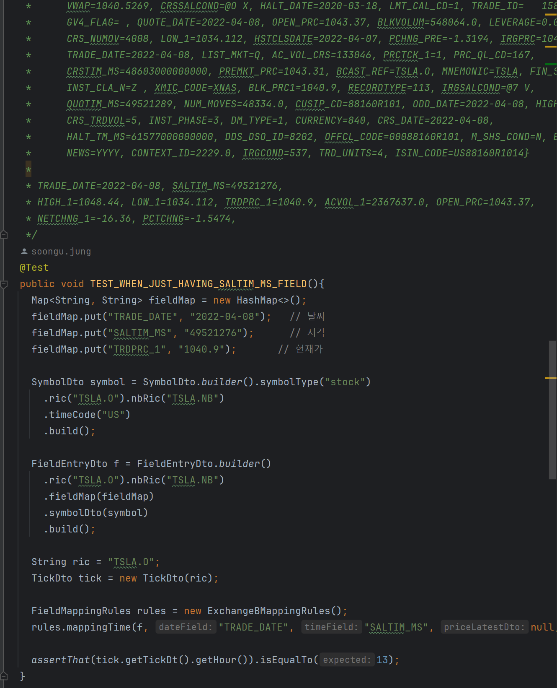

## 테스트케이스 경험

## 필드 매핑 파악의 어려움 : 로그 추출 & 필드매핑 테스트 코드

레피니티브로부터 전달되는 시세 데이터는 아래와 같은 형식으로 전달됩니다.

각각의 필드가 어떻게 나타나는지는 우리나라의 개발자 플랫폼 처럼 친절하게 제공되는 가이드 문서는 없으며 개발자가 일일이 개발자 포럼을 일일이 찾아서 파악을 해야합니다. 당시 개발 기한도 빠듯했지만, 이 필드 매핑을 따로 파악해줄만한 인력이 없었습니다. 가끔씩 주식 운용을 담당하는 내부 직원 분이 초봉,분봉을 보고   이 필드가 현재가이고 이 필드를 사용하면 단된다거나 이런 내용들을 봐주시기도 했는데, 개발자가 파악했을 때보다 가끔 정확했을 때가 있어서 가끔 놀랐던 것 같습니다. 

그리고 위에서 나타나는 각각의 필드는 어떤 때는 나타나고 어떤 때는 나타나지 않습니다. 전달 받는 데이터가 어떤 거래 유형인지에 대해서도 제공되지 않기에 로직 내에서 거래 유형을 파악하는 로직들을 코드로 직접 작성해왔습니다. 

 

위와 같은 거래데이터들을 필드 매핑을 하기 위해서 아래와 같이 로그 파일로 추출했습니다.

 

그리고 이 로그 내에서 실제 서비스에서 필요한 필드들만 추려내기 위해 객체를 정의하고 이 것을 json 으로 변환하는 작업을 거쳤습니다.

 

그리고 이 필드 들 주에서 어떤 것이 거래 시각이 맞는지, 어떤 것이 거래가격인지를 보고 시간단위등도 함께 고려해서 레피니티브 개발자 포럼의 필드 설명에 맞춰서 어떤것이 맞는지 대조를 하는 과정을 직접 해왔습니다. 이렇게 해서 찾아낸 필드 매핑들은 아래와 같이 테스트 코드 작성을 통해 명세화 하고 멱등성을 갖도록 해줬습니다.

 

## Hazelcast 캐시 자료구조 테스트 코드 검증

## 비동기 로직의 호출 여부 테스트 코드 검증

## Tick 집계 코드 테스트 코드 검증

## docker-compose, testcontainer 를 이용한 Database 코드 검증

## 전반적인 테스트 코드들

