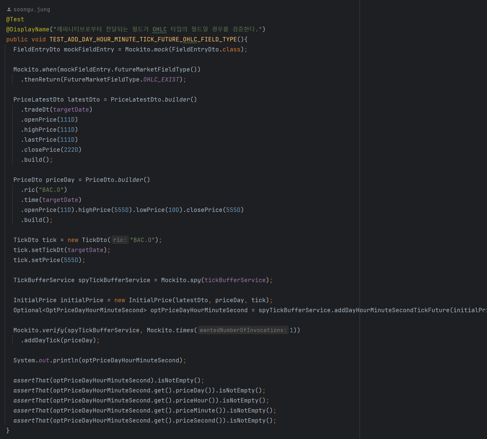
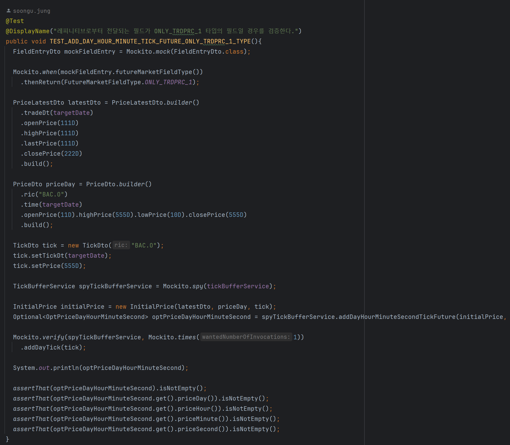
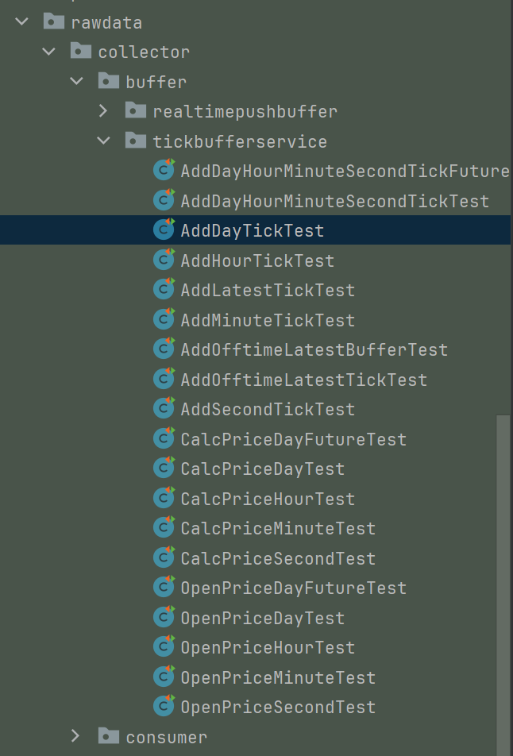
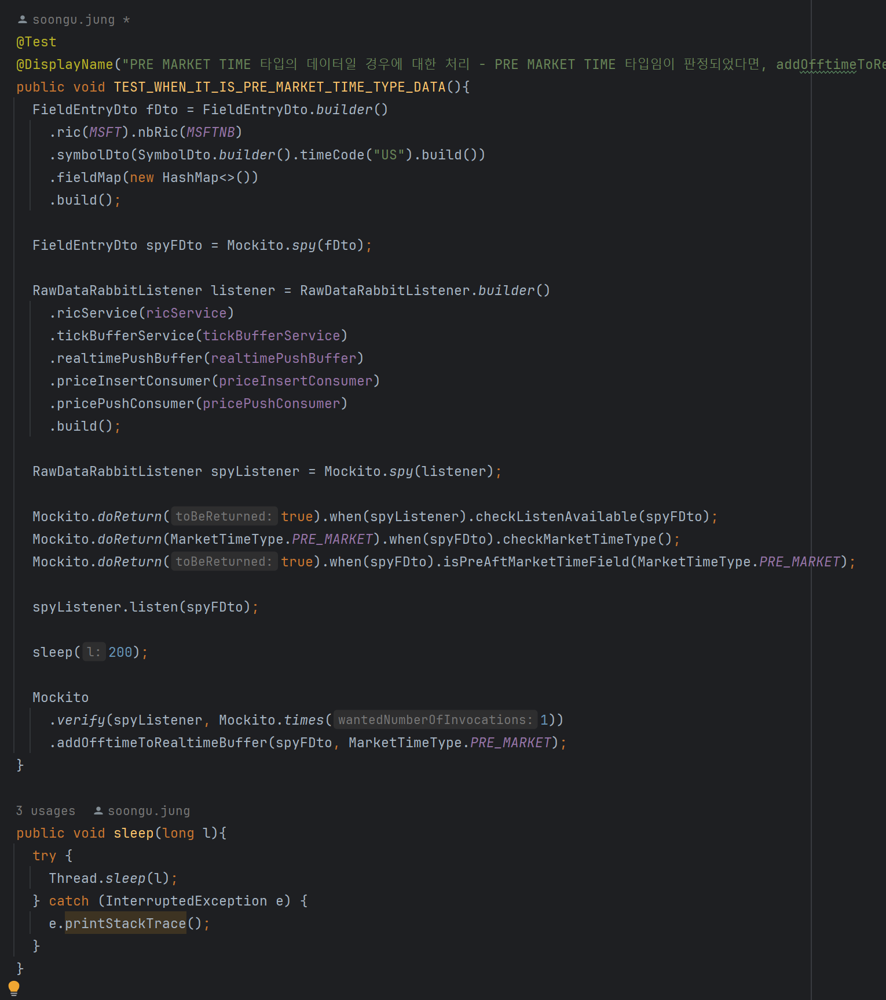
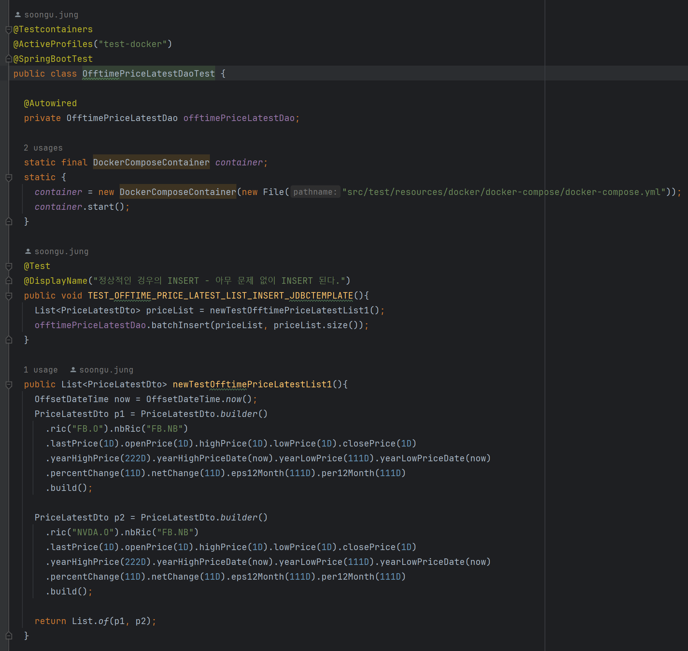
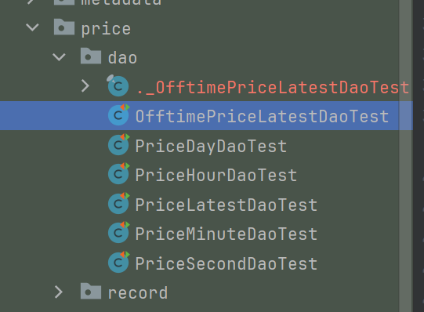
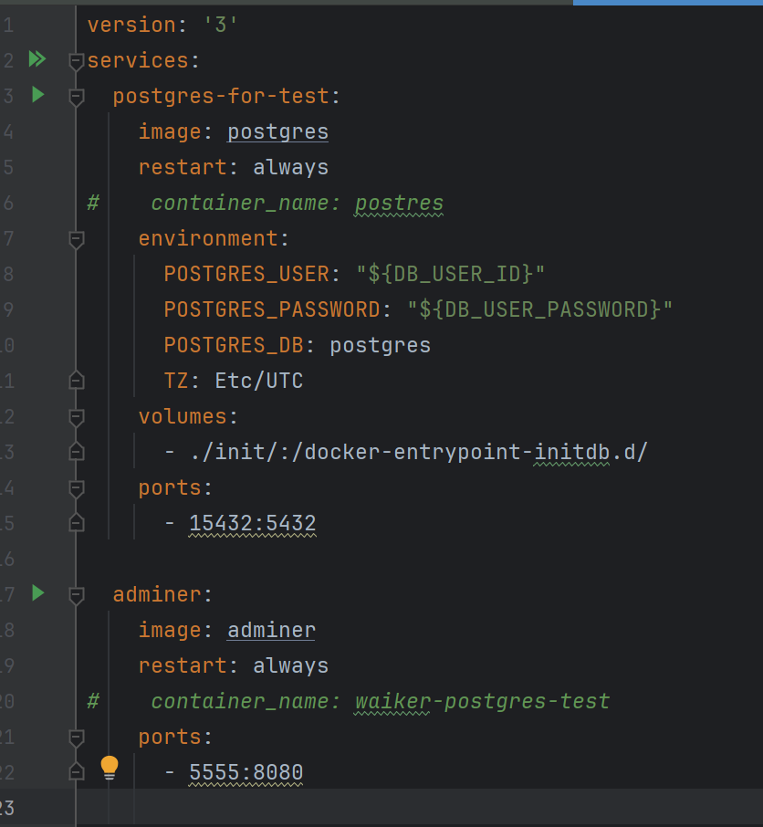
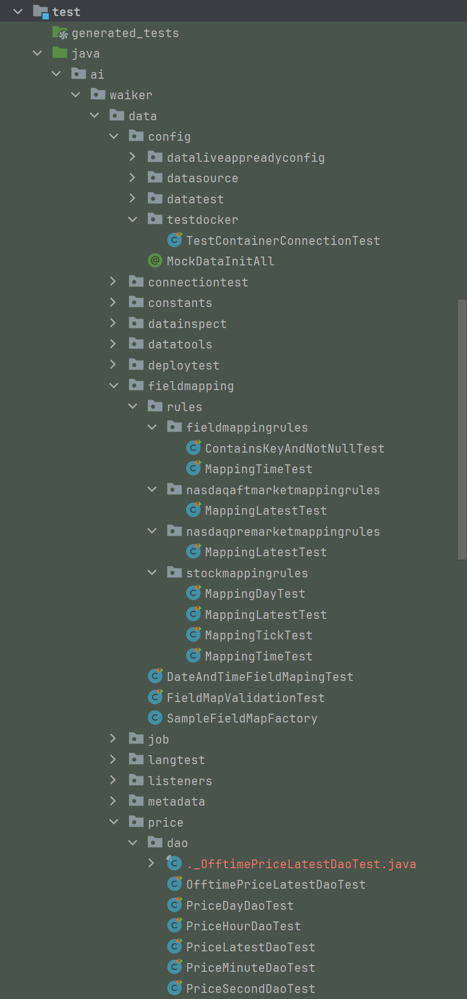
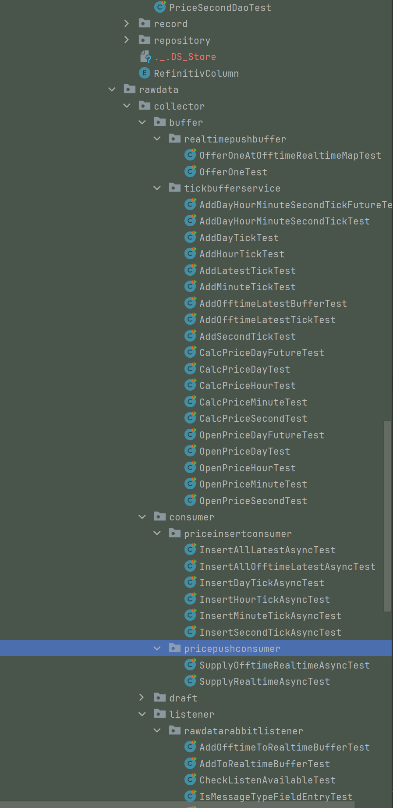

## 테스트케이스 경험

## 필드 매핑 파악의 어려움 : 로그 추출 & 필드매핑 테스트 코드

레피니티브로부터 전달되는 시세 데이터는 아래와 같은 형식으로 전달됩니다.

각각의 필드가 어떻게 나타나는지는 우리나라의 개발자 플랫폼 처럼 친절하게 제공되는 가이드 문서는 없으며 개발자가 일일이 개발자 포럼을 일일이 찾아서 파악을 해야합니다. 당시 개발 기한도 빠듯했지만, 이 필드 매핑을 따로 파악해줄만한 인력이 없었습니다. 가끔씩 주식 운용을 담당하는 내부 직원 분이 초봉,분봉을 보고   이 필드가 현재가이고 이 필드를 사용하면 단된다거나 이런 내용들을 봐주시기도 했는데, 개발자가 파악했을 때보다 가끔 정확했을 때가 있어서 가끔 놀랐던 것 같습니다. 

그리고 위에서 나타나는 각각의 필드는 어떤 때는 나타나고 어떤 때는 나타나지 않습니다. 전달 받는 데이터가 어떤 거래 유형인지에 대해서도 제공되지 않기에 로직 내에서 거래 유형을 파악하는 로직들을 코드로 직접 작성해왔습니다. 

 

위와 같은 거래데이터들을 필드 매핑을 하기 위해서 아래와 같이 로그 파일로 추출했습니다.

 

그리고 이 로그 내에서 실제 서비스에서 필요한 필드들만 추려내기 위해 객체를 정의하고 이 것을 json 으로 변환하는 작업을 거쳤습니다.

 

그리고 이 필드 들 주에서 어떤 것이 거래 시각이 맞는지, 어떤 것이 거래가격인지를 보고 시간단위등도 함께 고려해서 레피니티브 개발자 포럼의 필드 설명에 맞춰서 어떤것이 맞는지 대조를 하는 과정을 직접 해왔습니다. 이렇게 해서 찾아낸 필드 매핑들은 아래와 같이 테스트 코드 작성을 통해 명세화 하고 멱등성을 갖도록 해줬습니다.

 

## Tick 집계 코드 테스트 코드 검증

레피니티브로부터 전달되는 데이터는 시가/고가/저가/종가가 갖추어진채로 전달되는 경우도 있고, 단순히 현재가만 전달해주는 경우도 있습니다. 처음 개발을 시작할 때에는 이런 데이터 유형이 보통 어떤 시점에 오는지를 몰랐기에 두가지 테스트 케이스를 모두 작성했습니다.  

**시가/고가/저가/종가 테스트코드**

 

시가/고가/종가/저가 데이터 없이 현재가만 메시지로 오는 경우에 대한 데이터 매핑

나중에 운영 경험이 3개월 이상 쌓이면서 부터 시가/고가/저가/종가를 같이 메시지로 보내주는 경우는 확률적으로 개장 전후 5분내외, 장 마감 전후 5분 내외에 발생한다는 사실을 알게되었습니다. 

이 외에도 각종 시/고/저/종 가격을 집계하는 코드들에 대해 모두 단위 테스트 코드를 모두 일일이 만들어두어서 테스트 케이스화 하고, 명세화해서 해당 기능의 확인과 검증을 쉽게했고, 배포 시에 자신감을 갖고 배포할 수 있게 되었습니다. 

## 비동기 로직의 호출 여부 테스트 코드 검증

listener 로직에서는 ExecutorService 기반으로 tick 집계 로직을 수행했습니다. tick 집계시에 IO 작업은 캐시에 쌓아두기만 하기에 응답의 지연은 없었고, ExecutorService 의 동작이 올바르게 동작하는지를 검증하기 위해 아래와 같은 코드를 작성했습니다. 

당시에는 builder 를 사용했었는데, 현시점에서 다시 돌아봤을 때, 테스트 코드 작성시 필요한 TestFixture 를 테스트 스코프에 별도로 테스트 케이스마다 구현을 해두어서 별도로 테스트 케이스를 정의했을 것 같습니다.

 

## docker-compose, testcontainer 를 이용한 Database 코드 검증

docker-compose 를 testcontainer 를 기반으로 구동해서 DAO 로직의 테스트를 검증했었는데 그 테스트 코드는 아래와 같습니다.

 

이렇게 모든 실시간 데이터 처리 작업을 하는 데이터 모듈들은 아래와 같이 모두 테스트코드화 했습니다.

 

그리고 위의 코드에서 사용하는 docker-compose.yml 파일은 아래와 같습니다.

 

## 전반적인 테스트 코드들

이 외에도 굉장히 많은 테스트 코드들을 작성해두었는데, 아래와 같이 굉장히 많은 테스트 코드를 남겨두었고 대부분 어떤 특정 상태에 의존되지 않도록 하면서 배포 전에 모든 테스트를 돌려봤을 때 실패하는지를 1차적으로 검증할 수 있는 간편한 수단이었습니다. 이렇게 해두면서 1인 개발 체제에서 힘에 부치던 상황에서 배포하려는 기능에 대해 자신감을 가지게 되었던 기억이 있습니다.

 

