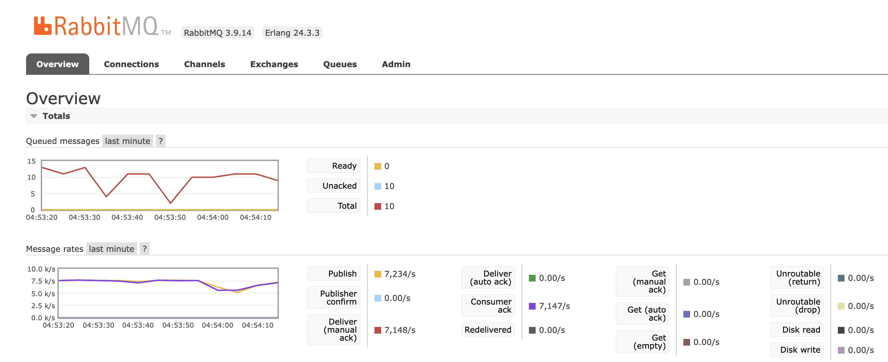

## 경력기술서

## 웨이커 (2021.06 \~ 2022.06)

### 신규 서비스 API 개발

레거시 서비스(valuesight)의 종료로 인한 신규서비스(waiker)의 API 개발업무를 진행했습니다. 

대가들의 분석, 뉴스, 주요재무, AI종목분석, 종목정보 등 주식 탭에 존재하는 API 개발을 담당했고 주로 AI 개발자 분들의 분석 데이터, 크롤링 데이터를 쌓아두기 위한 테이블 설계, 웹/앱에서 데이터 조회를 위한 API 구현 등이 주된 업무였습니다. 

 

### 레피니티브 증권 시세 데이터 처리 시스템 구축

#### 프로젝트 설명

한국증권거래소 처럼 증권 시세를 Serving 하는 레피니티브라고 하는 회사의 시세 데이터를 1차 가공한 후 웹소켓 Push, Database 저장하는 것을 담당하는 시스템입니다. 

 

#### 트래픽 규모

트래픽은 아래와 같이 2.5k/s \~ 7.5k/s 였습니다. 

> 개장(Market Open) 트래픽 추이 

 

> 폐장(Markt Close) 트래픽 추이

 

#### 주요 문제

2.5k/s \~ 7.5k/s 의 트래픽을 밀리지 않고 데이터를 저장하고, 웹소켓을 통해 웹/앱 으로 Push 를 해야 했습니다. 

웹소켓 푸시, 데이터 저장에 드는 I/O 작업의 시간 비용은 고정적으로 소모되므로, 일반적인 서버 애플리케이션의 처리방식과는 다른 접근방식이 필요했습니다. 또한, 요청이 유실 되었을 경우 이것을 복구해낼 방법이 필요했는데 이 부분에 대한 접근방식도 필요했습니다. 

 

#### 메시지 큐 기반 작업 분배 방식 도입

작업의 성격별로 서버 애플리케이션을 3가지로 분류해서 아래와 같이 나눴고, 각각이 별도의 서버 애플리케이션으로 동작하도록 구성했습니다.

- `waiker-data-live` 
  - 레피니티브 raw 데이터 수신
  - 거래시각데이터를 LocalTime, LocalDate 기반 의 데이터로 변환
  - 변환된 RabbitMQ 메시지 큐에 데이터 적재
- `waiker-data-collector`
  - 필드 매핑 작업 (가장 어려운 작업입니다.)
  - 일/시/분/초 단위 별 시가/고가/종가/저가 계산
  - offheap 캐시 적재
  - PostgreSQL 에 집계 데이터 저장
- `waiker-data-websocket`
  - 웹/앱 단말로 웹소켓 푸시 작업 처리
  - 웹/앱 단말이 많아질 수록 부하가 높아지는 인스턴스

 

#### 스케쥴링 기반의 소규모 배치작업 구조로 전환

코틀린의 코루틴이 스레드 하나를 여러개의 코루틴으로 나누어서 CoroutineDispatcher 가 코루틴의 실행/중지/재개/종료를 담당하는 것과 비슷한 원리를 스레드 풀 관리로직에 적용했습니다. ExecutorService 스레드 풀을 작게 잡고 이것을 스케쥴러 스레드를 이용해서 작업을 스케쥴링하고 각각의 작업을 CompletableFuture 를 이용해서 비동기 처리하는 방식으로 문제를 해결했습니다. 

 

#### 더 자세한 내용

웨이커에서 마지막으로 수행했던 증권 시세 데이터 처리 프로젝트는 별도의 설명이 필요해서 아래 링크에 더 자세한 내용을 확인하실 수 있습니다. 
- [시스템 설계 경험](/architecture-experience/intro/)
 

## 디케이테크인 (2019.11 \~ 2021.06)

디케이테크인에서는 아래와 같은 업무들을 수행했습니다.

- 뮤직 DNA 6.0 개편 : 월간/주간 개인 선호음악/추천음악 조회 백엔드 API 개발
- 피드, 마이로그 6.0 개편 : 개인화 영역 소식 내역 메시지 생성 기능 개발
- 멜론 댓글 서비스 운영/유지보수
  - 슬로우 쿼리 유지보수/대응
  - 카카오 클린플랫폼 연동 블랙리스트 기능 개발
- 멜론 HiFi/음원/스테이션/카카오뮤직/계정 유지보수

 

상용서비스를 개발하는 개발 유닛에서 함께 개발에 참여했고, 그 당시 생소한 개념이었던 Resilience4J 의 서킷브레이커 등의 Spring Cloud 개념들을 내부 개발 유닛의 개발 문서를 통해 접해보기도 했었고 카카오 클린 플랫폼의 블랙리스트 기능 연동시 이 기능을 적용했던 경험이 있습니다. 

디케이테크인에서 멜론 운영업무를 하면서 카카오 개발자 공채 출신 직원 분도 뵜었고, 멜론 출신 개발자 분들도 뵜었고, 기획자 분들도 뵜었고 이 외에도 굉장히 다양한 분들을 접했습니다. 멜론 개발 셀은 항상 스터디하는 습관이 베어있던 개발 조직이었기에 여기서 보고 배운 습관이 평소에도 기술 스터디를 꾸준히 하는 습관으로 이어졌습니다. 

 

### 멜론 키즈 프로모션이 스테이션 배너에 랜딩되지 않던 이슈

스테이션 배너 앱 랜딩에 멜론 키즈의 프로모션이 랜딩되지 않는 이슈가 있었습니다. 멜론모바일, 멜론웹, 멜론 공통 모듈까지 모두 검사해서 어떤 부분이 잘못되었는지 찾아가는 과정을 겪었고, 결론은 멜론 어드민 내의 상수 코드 값이 빠져있어서 생기는 이슈였다는 것을 파악했습니다. 

결론은 굉장히 쉬워보이지만 워낙 많은 인원들의 입사와 퇴사를 거친 레거시 코드이기에 버그의 원인을 찾는데에 2주 반 정도 소요됐었고, 이 버그에 대한 히스토리조차도 없이 맨땅에서부터 시작해서 문제를 해결해나갔었기에 가장 어려웠던 경험이었습니다. 

 

## 누리플렉스 (2018.01 \~ 2019.11)

누리플렉스에서는 아래와 같은 업무들을 수행했습니다.

SK E&S STEP 에너지 모니터링 솔루션 개발/운영업무

- 장비 개별정보 현황/이력(통계) 데이터 조회 API 설계/구현

- 데이터 시각화 (차트라이브러리, 그리드 라이브러리 연동 등)

SUSTERA PMS 에너지 모니터링 솔루션 개발/운영

- 장비 개별정보 현황/이력(통계) 데이터 조회 API 설계/구현

- 데이터 시각화 (차트라이브러리, 그리드 라이브러리 연동 등)

CJ/부산 신재생 에너지 혁신센터 EMS 운영/유지보수

- MQ 데이터 트래픽 서버의 잦은 장애로 인한 SockJS 측에서의 예외처리

- 이슈 및 개별 장애 대응 

 

위 업무 들 중 가장 기억에 남았던 문제해결 경험은 **CJ/부산 신재생 에너지 혁신센터 EMS 운영/유지보수** 시에 겪었던 MQ 데이터 트래픽 서버 장애 처리 경험입니다. 

 

### MQ 데이터 트래픽 서버 장애에 대한 SockJS 타임아웃 처리

CJ/부산 신재생 에너지 혁신센터 시스템 운영 당시 개발팀에는 한전이나 LS로부터 전달받는 소켓 데이터를 Active MQ를 통해 웹소켓 데이터로 발송하거나 DB에 데이터를 INSERT하는 IO 작업을 담당하는 개발자 분이 계셨습니다. 한전/LS 로부터 전달받는 단건 데이터의 빈도에 비해 웹소켓/데이터저장 처리 속도가 물리적으로 느리기에 전기요금이 경부하 기간인 새벽시간 대에는 전기 충전 트래픽이 몰려 서버가 다운되는 현상이 있었습니다. 

이런 이유로 MQ서버 개발자 분께서는 야간에 자주 서버를 재기동하셨습니다. 

당시 저는 WAS 측의 운영을 담당하고 있었습니다. 서버 재기동이 영향을 주던 기능은 ESS 충방전현황 대시보드 내의 실시간 충전현황과 외기 온도를 보여주는 기능이었습니다. 서버를 재기동하기에 웹소켓 커넥션이 유실되는 것으로 인해 UI상으로는 관련된 기능이 다운된 것처럼 보이는 현상이 있었습니다. 

이 문제에 대해 **‘소켓 접속이 끊어지더라도 주기적으로 서버에 재접속 요청을 하도록 구성하는 것’** 이라는 점에 포인트를 주어 해결해야겠다는 결론을 내렸습니다. 그리고 SockJS 공식 문서를 참고해 SockJS의 내부 코드 중 디폴트 설정을 파악해서 디폴트 설정을 수정하고 기본으로 제공되는 SockJS 내부 코드의 일부분을 커스터마이징 해 문제를 해결했습니다.  

수정했던 디폴트 설정은 ‘네트워크 커넥션 타임아웃 기간’, ‘재접속 Retry 주기’ 등 이었고, 무한대로 접속 요청을 하는 것으로 인한 부하 역시 줄여야 하기에 ‘재접속 횟수’에 제한을 걸어서 재접속 요청을 하도록 SockJS 소스코드를 수정해 배포했습니다. 

MQ 서버 처리로직에 안정성에 문제가 많았고 결함이 많았지만, 클라이언트 측(SockJS)의 코드를 유연하게 구성해서 제품의 문제가 발생하더라도 유연하게 장애에 대응했던 경험이라고 생각합니다. 

 

## 주니코리아 (2015.05 \~ 2017.04)

3G/4G 무선신호를 WIFI 로 변환해주는 기업용 데이터 네트워크 라우터들의 모니터링, 관리/제어를 위한 솔루션 유지보수/개발 업무를 해왔습니다. 

Hardware Replacement (TELSTRA)

- JAVA GUI, TCP/IP 통신 로직 개발

HEMS 유지보수/개발/운영

- QA 대응, 유지보수/개발/운영, 트러블 슈팅

 

### 논블로킹 처리 경험

Java GUI 애플리케이션에서 TCP/IP 통신 로직을 작성할 때 주로 외부 API를 호출할 때 GUI에 관련된 메인 스레드를 IO작업이 블로킹하지 않도록 로직을 구현하는 작업들이 많았습니다. 예를 들면 네트워크 설정파일(json, xml)의 SFTP Upload/Download 를 진행과 동시에 프로그래스바 UI에 진행률을 표시하는 기능을 구현하는 등의 작업 등을 해왔습니다.

